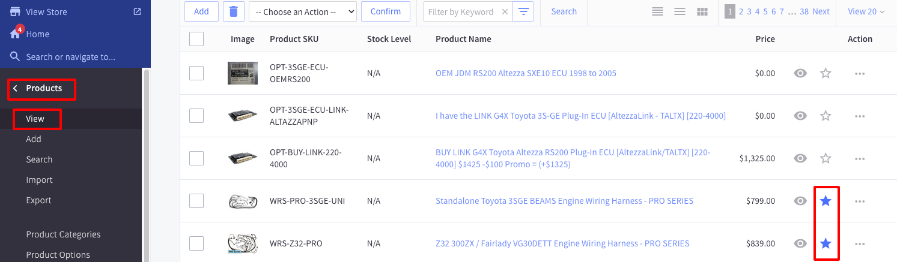

# Homepage
The homepage is the main page of the website. It is the first page that the user sees when they visit the website.

## Hero Banner

The Hero Banner Carousel is using the built-in BigCommerce Home Page Carousel.
Please follow the <a href="https://support.bigcommerce.com/s/article/Carousel?language=en_US" target="_blank">BigCommerce documentation</a> to see how to manage it.
Please note that the styles are in the theme and should not be changed unless you are confident in your abilities.

## Featured Products

The Featured Products panel displays products that you have marked as Featured.
To mark a product as Featured, simply go to the product listing via Products->View, then click on the star symbol on the product you want to display.

## Full Banner

The full Banner is made using a BigCommerce widget. You can change it in the [Page Builder](/#page-builder).

You can change the text by clicking on it

You can toggle the visibility, add more slides, change the image, and more by clicking on the options on the left side.
Please note that due to the custom design of the theme, some options may not work as expected.

## Small Banner

This is the custom widget called 'cta'. You need to select the style CTA to display the style like this one.

## Logo List

This is the custom widget called 'logos'. You can add multiple logos, delete, duplicate, rearrange, and more.

