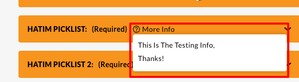
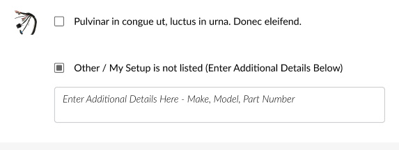
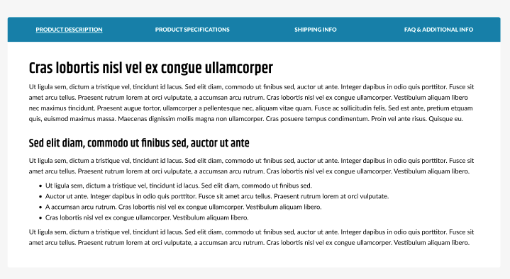
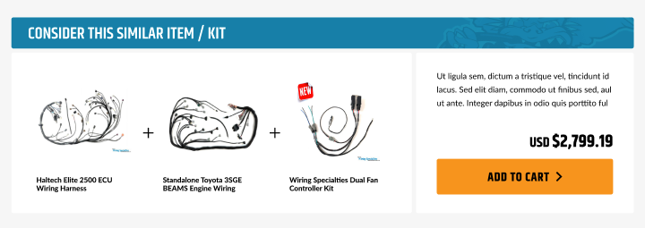
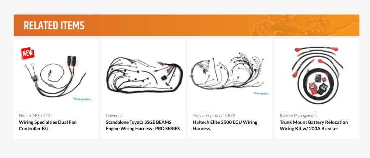

# Product Page
The product page displays the information about the product. It includes the product name, description, price, options, and an image of the product.

Most of the product page is built with the default BigCommerce settings, for more information regarding how to add a product in Bigcommerce with the V2 settings, refer to this <a href="https://support.bigcommerce.com/s/article/Adding-Products-v2?language=en_US" target="_blank">documentation</a>. 

There are some parts on the product page that need to follow specific guidelines.

## Short Description

The short description is a brief description of the product. It should be a short paragraph that describes the product in a few sentences. The short description should be displayed at the top of the product page.
It is not mandatory, so not all the products will have it.

## 'More Info' in product picklist

The product picklist is a dropdown menu that allows the user to select different options for the product. To display the 'More info' button in the product picklist, we need to add the information in the Metafields.

## 'Other' option with input field

The 'Other' option with an input field is a custom option that allows the user to enter a custom value for the option when selecting 'Other'. To add the 'Other' option with an input field, we need to have an input text with the same name as the 'Other' option. from the previous set of options.

## Product tabs

The product tabs are used to display additional information about the product. The tabs include the description, specifications, shipping info, and FAQ. 
The content comes from the product description, following a specific format, like the one already set in some of the current products.
The format should be as follows:
The shipping info comes from the 'Availability text' field in the product settings.

## Similar Items

The similar items section displays products that are similar to the current product and they can be added all at once by clicking on the button. Note that this is not the Related Items. The products are set using metafields and they must be simple products (with no variants).

## Related Items

The related items section displays products that are related to the current product. These are usually automatically picked by BigCommerce or can be set manually in the product settings.
Please refer to the BigCommerce <a href="https://support.bigcommerce.com/s/article/Adding-Products-v2?language=en_US#related" target="_blank">documentation</a> for more details.
